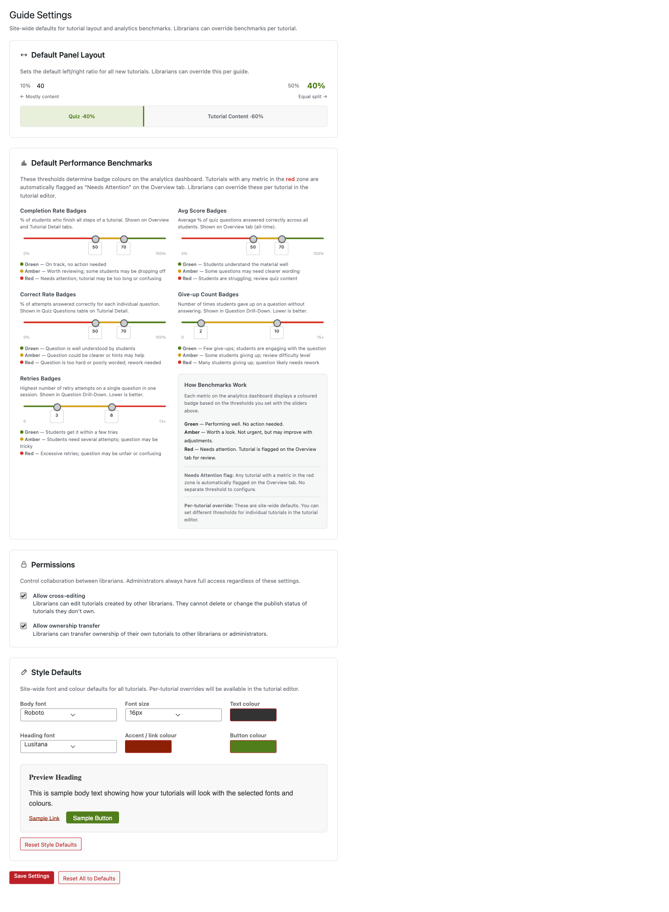
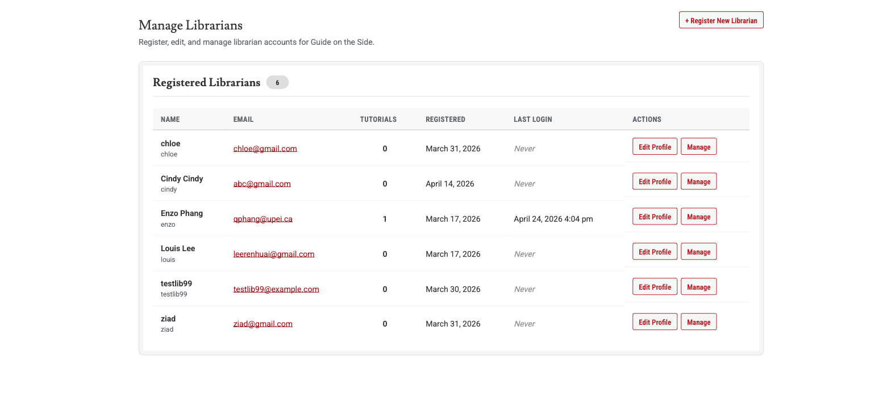
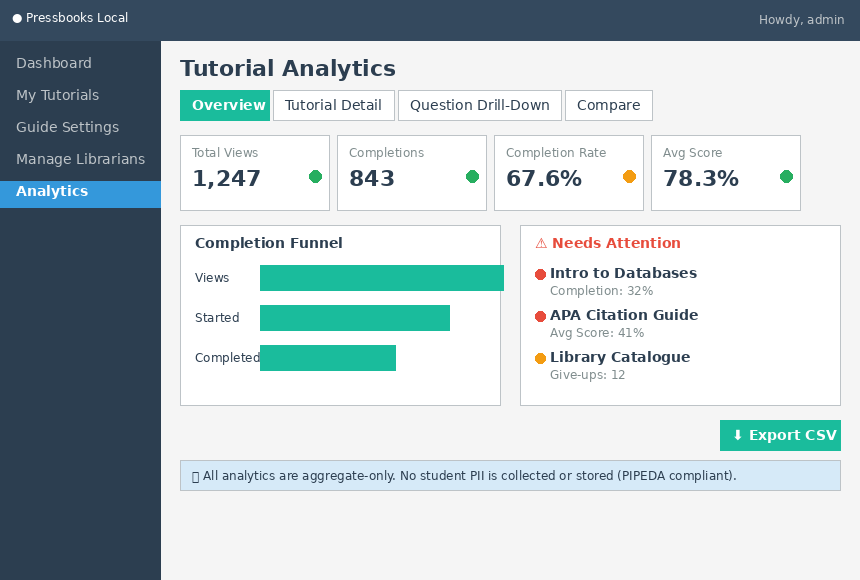
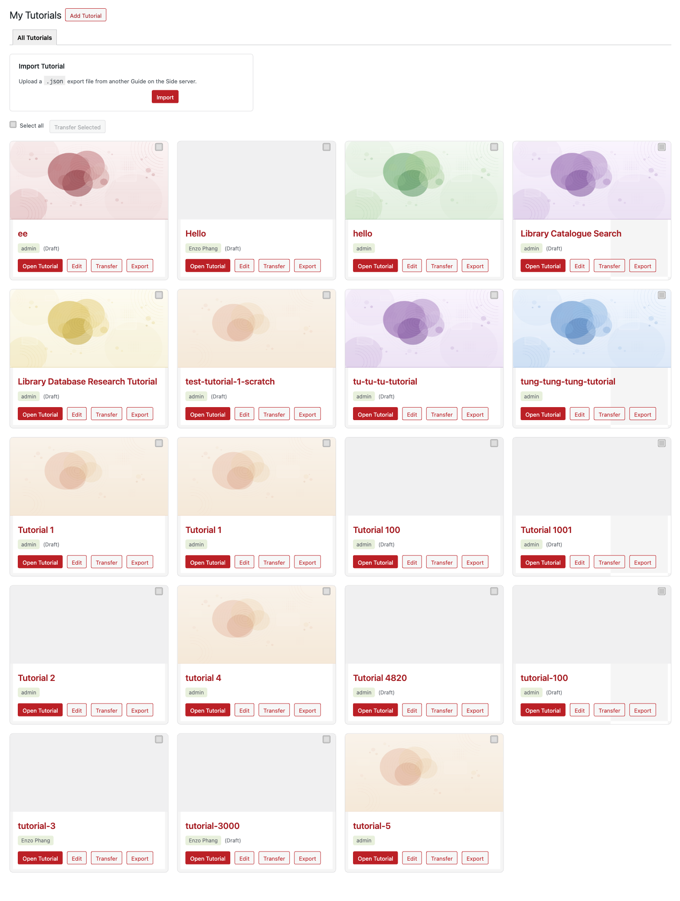
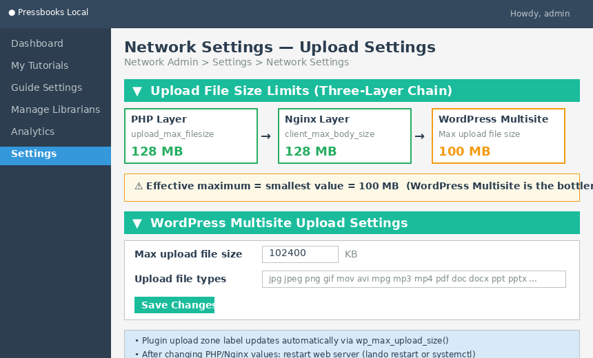

# Guide on the Side — Administrator Guide

**Plugin**: PB Split Guide (pb-split-guide) v0.5.0
**For**: UPEI Library — Pressbooks Interactive Tutorial System
**Last Updated**: April 24, 2026

---

## Table of Contents

### Part 1: Local Testing Setup
1. [Overview](#overview)
2. [Prerequisites](#prerequisites)
3. [Install Docker Desktop](#step-1-install-docker-desktop)
4. [Install Lando](#step-2-install-lando)
5. [Get the Project Files](#step-3-get-the-project-files)
6. [Configure the Environment](#step-4-configure-the-environment)
7. [Start the Environment](#step-5-start-the-environment)
8. [Install Plugin Dependencies](#step-6-install-plugin-dependencies)
9. [Verify the Setup](#step-7-verify-the-setup)
10. [Daily Commands](#daily-commands)
11. [Local Setup Troubleshooting](#local-setup-troubleshooting)

### Part 2: Production Deployment
12. [Production Prerequisites](#production-prerequisites)
13. [Upload the Plugin](#step-1-upload-the-plugin-1)
14. [Install H5P](#step-2-install-h5p)
15. [Activate the Plugins](#step-3-activate-the-plugins)
16. [Verify Activation](#step-4-verify-activation)

### Part 3: Configuration & Administration
17. [Plugin Settings](#plugin-settings)
18. [Managing Librarian Accounts](#managing-librarian-accounts)
19. [Analytics Dashboard](#analytics-dashboard)
20. [H5P Quiz Content](#h5p-quiz-content)
21. [Export & Import Tutorials](#export--import-tutorials)
22. [Accessibility Features](#accessibility-features)

---

## Overview

This guide covers three things:

1. **Local Testing** — Set up the full Guide on the Side environment on your desktop to evaluate the plugin before deploying it
2. **Production Deployment** — Install the plugin on your library's existing Pressbooks server
3. **Configuration & Administration** — Manage settings, librarian accounts, analytics, and content

The local testing setup uses **Lando**, a Docker-based tool that creates an isolated WordPress + Pressbooks environment on your computer. This is the same setup the development team uses, so what you see locally will match production behavior.

---

## Part 1: Local Testing Setup

### Prerequisites

Before starting, you need:

- **A computer running macOS or Windows** (Linux also works)
- **At least 8 GB of RAM** (Docker and Lando run multiple containers)
- **~5 GB of free disk space** (for Docker images and the project)
- **An internet connection** (for initial download of Docker images)

You will install two tools:
1. **Docker Desktop** — runs containers (lightweight virtual machines) on your computer
2. **Lando** — orchestrates the containers into a working WordPress + Pressbooks environment

### Step 1: Install Docker Desktop

Download and install Docker Desktop for your operating system:

- **macOS**: https://www.docker.com/products/docker-desktop/ — download the `.dmg`, open it, drag Docker to Applications
- **Windows**: https://www.docker.com/products/docker-desktop/ — download the `.exe` installer, follow the wizard. Requires WSL2 (the installer will prompt you to enable it)
- **Linux (Ubuntu/Debian)**:
  ```
  sudo apt update
  sudo apt install -y docker.io docker-compose-plugin
  sudo systemctl enable --now docker
  sudo usermod -aG docker $USER
  ```
  **Log out and back in** after running these commands for the group change to take effect.
- **Linux (other distros)**: Follow the official Docker Engine install guide for your distro: https://docs.docker.com/engine/install/

After installing, **open Docker Desktop** (macOS/Windows) or verify the Docker service is running (Linux).

**Verify it's working** — open a terminal and run:

```
docker --version
```

You should see something like `Docker version 27.x.x`.

---

### Step 2: Install Lando

Download the Lando installer for your operating system:

- **macOS**: https://lando.dev/download/ — download the `.dmg`, open it, drag to Applications
- **Windows**: https://lando.dev/download/ — download the `.exe` installer, follow the wizard
- **Linux (Ubuntu/Debian)**:
  ```
  wget https://files.lando.dev/installer/lando-x64-stable.deb
  sudo dpkg -i lando-x64-stable.deb
  ```
- **Linux (other distros)**: See https://docs.lando.dev/install/linux.html for your package manager

**Verify it's working:**

```
lando version
```

You should see something like `v3.21.x`.

### Step 3: Get the Project Files

You can get the project files in two ways:

**Option A — Clone with Git** (if you have Git installed):

```
git clone https://github.com/qixiang03/guide-on-the-side.git
cd guide-on-the-side
```

**Option B — Download a zip** from the development team. Extract it and open a terminal in the extracted folder.

---

### Step 4: Configure the Environment

**4a. Create environment files:**

```
cp .env.example .env
cp config_services/.env.example config_services/.env
```

> If you're on Windows (PowerShell), use: `Copy-Item .env.example .env` and `Copy-Item config_services\.env.example config_services\.env`

**4b. Generate security keys:**

1. Visit https://roots.io/salts.html in your browser
2. Copy the generated keys
3. Open the `.env` file in a text editor
4. Replace each `'generateme'` value with the corresponding generated key

The lines to replace look like this:

```
AUTH_KEY='generateme'
SECURE_AUTH_KEY='generateme'
LOGGED_IN_KEY='generateme'
NONCE_KEY='generateme'
AUTH_SALT='generateme'
SECURE_AUTH_SALT='generateme'
LOGGED_IN_SALT='generateme'
NONCE_SALT='generateme'
```

**4c. Set your computer's architecture:**

Open `config_services/.env` in a text editor and set:

- **Apple Silicon Mac** (M1/M2/M3/M4): `ARCHITECTURE=arm64`
- **Intel Mac or Windows**: `ARCHITECTURE=amd64`

**4d. Obtain the database dump:**

Ask the development team (Enzo or Daniel) for the file `pb_local_db.sql`. Place it in the project root folder:

```
guide-on-the-side/
├── pb_local_db.sql    ← place it here
├── .env
├── .lando.yml
└── ...
```

This file contains a pre-configured WordPress + Pressbooks database so you don't have to set up everything from scratch. It is automatically imported when you start the environment.

> **Don't have the database dump?** You can still set up WordPress manually — see [Local Setup Troubleshooting](#local-setup-troubleshooting) at the end of Part 1.

### Step 5: Start the Environment

From the project folder, run:

```
lando start
```

**This will take 5–10 minutes on first run.** Lando is downloading and building:
- PHP 8.3 with Nginx (web server)
- MariaDB 10.5 (database)
- Redis 5.0 (caching)
- Mailhog (email capture for testing)
- Node.js (frontend tooling)
- WordPress 6.9 with Pressbooks and H5P

It also installs all PHP dependencies via Composer and imports the database dump automatically.

When it finishes, you'll see output like:

```
APPSERVER NGINX URLS
 https://pressbooks.test
 http://pressbooks.test
```

> **Important**: The local site runs at `pressbooks.test`, NOT `localhost:8080`. Lando sets up a proxy domain automatically.

> **SSL warning**: Your browser will show a security warning because Lando uses a self-signed certificate. Click **Advanced → Proceed** (or "Accept the Risk" in Firefox) to continue. This is normal for local development.

---

### Step 6: Install Plugin Dependencies

The pb-split-guide plugin uses TCPDF for generating PDF certificates. Install its dependencies:

```
lando composer install --working-dir=web/app/plugins/pb-split-guide
```

---

### Step 7: Verify the Setup

Open these URLs in your browser to confirm everything is working:

| What | URL |
|------|-----|
| Pressbooks home | https://pressbooks.test |
| WordPress Admin | https://pressbooks.test/wp/wp-admin/ |
| Network Admin | https://pressbooks.test/wp/wp-admin/network/ |
| Mailhog (email) | http://localhost:8026 |

**Quick test — create a tutorial:**

1. Go to **WordPress Admin** for a book site
2. Go to **Pages → Add New**
3. In the **Page Attributes** panel on the right, set the Template to **"Split Guide"**
4. You should see the **Split Guide Steps** metabox appear below the editor
5. Add a step with some text and an embed URL
6. Publish and view the page — you should see the split-screen layout

If all of this works, your local testing environment is ready.

### Daily Commands

Run these from the project folder:

| Command | What it does |
|---------|-------------|
| `lando start` | Start the environment |
| `lando stop` | Stop the environment (preserves all data) |
| `lando restart` | Restart all services |
| `lando rebuild` | Rebuild from scratch (re-installs dependencies) |
| `lando info` | Show all service URLs and ports |
| `lando mysql` | Open a MySQL shell to the database |
| `lando ssh` | Open a shell inside the web server container |

---

### Local Setup Troubleshooting

**"pressbooks.test" doesn't load in the browser**

Lando usually configures the domain automatically. If it doesn't resolve, add it manually:

- **macOS/Linux**: Open Terminal and run:
  ```
  echo "127.0.0.1 pressbooks.test" | sudo tee -a /etc/hosts
  ```
- **Windows**: Open PowerShell as Administrator and run:
  ```
  Add-Content C:\Windows\System32\drivers\etc\hosts "127.0.0.1 pressbooks.test"
  ```

**Browser won't accept the SSL certificate**

Use Firefox — it lets you add a permanent exception. Or use incognito/private mode.

**Cookies aren't sticking / can't stay logged in**

The environment forces HTTPS. If your browser rejects the self-signed certificate's cookies, try:
1. Use Firefox (most permissive with self-signed certs)
2. Use an incognito/private window
3. Clear your browser cookies for `pressbooks.test`

**Lando start fails or hangs**

```
lando rebuild
```

If that doesn't work:

```
lando destroy
lando start
```

> **Warning**: `lando destroy` deletes all database data. You'll need to re-import `pb_local_db.sql` (it happens automatically on next `lando start` if the file is still in the project root).

**No database dump available (manual WordPress setup)**

If you don't have `pb_local_db.sql`, you can set up WordPress manually after `lando start`:

1. Visit `https://pressbooks.test` and complete the WordPress installation wizard
2. The Bedrock configuration already has Multisite enabled, so Pressbooks should work immediately
3. Go to **Network Admin → Plugins** and network-activate **Pressbooks** and **H5P**
4. Go to **Network Admin → Sites → Add New** to create a test book site
5. Activate the **pb-split-guide** plugin on your test site
6. Install plugin dependencies: `lando composer install --working-dir=web/app/plugins/pb-split-guide`

This gives you a clean environment but without the team's shared test content.

---

## Part 2: Production Deployment

This section covers installing the plugin on your library's existing Pressbooks server. Since Pressbooks is already running, this is a straightforward plugin installation.

### Production Prerequisites

Before installing, confirm your server has:

- [ ] **PHP 8.2 or higher** — check with your server admin or run `php -v`
- [ ] **WordPress Multisite** — required by Pressbooks (if Pressbooks is running, you have this)
- [ ] **Pressbooks** — active and working
- [ ] **HTTPS** — the plugin requires a secure connection for analytics tracking
- [ ] **Server write access** — FTP, SFTP, or SSH to upload plugin files

### Step 1: Upload the Plugin

Upload the entire `pb-split-guide/` folder to your server's WordPress plugins directory:

```
your-pressbooks-server/
└── wp-content/
    └── plugins/
        └── pb-split-guide/       ← upload this entire folder
            ├── pb-split-guide.php
            ├── class-pbsg-analytics.php
            ├── class-pbsg-analytics-dashboard.php
            ├── includes/
            ├── templates/
            ├── assets/
            ├── accessibility-dashboard/
            ├── vendor/            ← important: include this (contains TCPDF)
            └── composer.json
```

**Methods:**
- **FTP/SFTP**: Use an FTP client (e.g., FileZilla, Cyberduck) to upload the folder
- **SSH**: Use `scp` or `rsync` to copy the folder to the server
- **WP Admin**: Zip the `pb-split-guide/` folder and upload via **Network Admin → Plugins → Add New → Upload Plugin**

> **Important**: Make sure the `vendor/` directory is included. It contains TCPDF, which is needed for PDF certificate generation.

### Step 2: Install H5P

If H5P is not already installed on your Pressbooks server:

1. Go to **Network Admin → Plugins → Add New**
2. Search for **"H5P"**
3. Install and **Network Activate** the H5P plugin

Or via WP-CLI (if available):

```
wp plugin install h5p --activate-network --allow-root
```

### Step 3: Activate the Plugins

1. Go to **Network Admin → Plugins**
2. Find **"PB Split Guide"** in the plugin list
3. Click **Network Activate**

On activation, the plugin automatically:
- Creates the `pbsg_librarian` role with appropriate capabilities
- Creates 3 database tables for analytics (`pbsg_tutorial_stats`, `pbsg_question_stats`, `pbsg_daily_stats`)
- Registers the Split Guide page template
- Adds admin menu items (My Tutorials, Tutorial Analytics, Guide Settings, Manage Librarians)

### Step 4: Verify Activation

**Check the admin menu**: Log in as a network admin. You should see these new menu items in the sidebar:
- My Tutorials
- Tutorial Analytics
- Guide Settings
- Manage Librarians

**Check the librarian role**: Go to **Network Admin → Users → Add New**. In the Role dropdown, you should see **"GOTS Librarian"** as an option. This confirms the `pbsg_librarian` role was created.

**Check the template**: Go to any book site → Pages → Add New. In the Page Attributes panel, you should see **"Split Guide"** as a template option.

**Check the database** (optional): If you have phpMyAdmin or database access, confirm these 3 tables were created:
- `wp_pbsg_tutorial_stats`
- `wp_pbsg_question_stats`
- `wp_pbsg_daily_stats`

(Table names use your WordPress table prefix — `wp_` by default. If your site uses a different prefix, substitute accordingly.)

> **No database migration needed**: This is a fresh plugin install on your existing Pressbooks database. The plugin creates its own tables automatically on activation.

> **Deactivation is safe**: If you deactivate the plugin, it removes the `pbsg_librarian` role but preserves the database tables and all tutorial content. Re-activating restores everything.

---

## Part 3: Configuration & Administration

### Plugin Settings

**Location**: My Tutorials → Guide Settings (admin only — requires `manage_options` capability)

This page controls site-wide defaults that apply to all tutorials. Librarians can override some of these settings per-tutorial in the tutorial editor.


*Figure 1: Guide Settings — Default Panel Layout and Performance Benchmarks*

#### Default Layout Ratio

Controls the left/right pane split for the tutorial split-screen view.

- **Range**: 10% to 50% (left pane)
- **Default**: 40% left / 60% right
- Librarians can override this per-tutorial in the tutorial editor's metabox

#### Benchmark Thresholds

Sets the amber and green cutoff values for 5 performance metrics. These thresholds determine the badge colors (red / amber / green) shown on the analytics dashboard.

| Metric | What it measures | Scale |
|--------|-----------------|-------|
| Completion Rate | % of students who finish the tutorial | 0–100% |
| Average Score | Mean quiz score across all students | 0–100% |
| Correct Rate | % of quiz answers that were correct | 0–100% |
| Give-up Count | Number of students who gave up on a question | 0–15 (lower is better) |
| Retries | Number of retry attempts on questions | 0–15 (lower is better) |

Each metric has two thresholds:
- **Below amber** → red badge (needs attention)
- **Between amber and green** → amber badge (acceptable)
- **Above green** → green badge (performing well)

Give-up Count and Retries use an inverse scale — lower numbers are better.

Librarians can override benchmarks per-tutorial in the tutorial editor.

#### Cross-Editing

- **Default**: Enabled
- When **on**: Librarians can view and edit tutorials created by other librarians, but cannot delete or publish them
- When **off**: Librarians only see their own tutorials

#### Ownership Transfer

- **Default**: Enabled
- When **on**: A "Transfer Ownership" bulk action appears on the Tutorials list, allowing admins to reassign tutorials between librarians
- When **off**: The bulk action is hidden

---

### Managing Librarian Accounts

**Location**: My Tutorials → Manage Librarians (admin only — requires `pbsg_manage_librarians` capability)


*Figure 2: Manage Librarians — Registered librarian accounts with Edit Profile and Manage actions*

#### Creating a Librarian

1. Go to **Manage Librarians**
2. Fill in the registration form: username, email, first name, last name
3. Click **Register Librarian**
4. The new librarian receives a welcome email with login instructions

#### What Librarians Can Do

The `pbsg_librarian` role is designed for content creators who build tutorials. They have access to:

| Can Do | Cannot Do |
|--------|-----------|
| Create, edit, and publish tutorials | Install or manage H5P libraries |
| Use H5P quiz content (Multiple Choice, Fill-in-the-Blank) | Access Plugins, Settings, or Appearance |
| View analytics and export CSV | Manage other WordPress users |
| Upload media (images, PDFs) | See other WP admin areas (Posts, Comments, Tools) |
| Edit their own profile | Delete or publish other librarians' tutorials (when cross-editing is on) |

When they log in, librarians are taken directly to **My Tutorials** instead of the WordPress dashboard. Their admin sidebar only shows relevant menu items.

#### Deactivating a Librarian

1. Go to **Manage Librarians**
2. Find the librarian and click **Deactivate**
3. You'll be prompted to reassign their tutorials to another librarian
4. The account is disabled but not deleted — it can be reactivated later

#### Reactivating a Librarian

1. Go to **Manage Librarians**
2. Find the deactivated librarian and click **Reactivate**
3. Their `pbsg_librarian` role is restored and they can log in again

---

### Analytics Dashboard

**Location**: Tutorial Analytics (visible to librarians and admins — requires `pbsg_view_analytics` capability)

The dashboard shows aggregate tutorial performance data. All analytics are **privacy-first**: no individual student is ever identified, no cookies are stored, and no login is required from students. This complies with PIPEDA privacy requirements.


*Figure 3: Tutorial Analytics — Overview tab with KPI cards, Views & Completions chart, and Needs Attention alerts*

#### Tabs

**Overview** — High-level KPIs across all tutorials:
- Total views, completions, and completion rate
- Aggregate metrics with benchmark badges (red/amber/green)

**Tutorial Detail** — Deep dive into a single tutorial:
- Funnel analysis (views → completions)
- Average dwell time per step
- Question-level statistics

**Question Drill-Down** — Per-question analysis:
- Attempt distribution (how many students got it right on the 1st, 2nd, 3rd try)
- First-attempt success rate
- Give-up and retry counts

**Compare Tutorials** — Side-by-side metrics for multiple tutorials

#### Filtering

- **Date range**: Filter data by start and end date
- **Device type**: Filter by desktop, tablet, or mobile

#### CSV Export

Click **Export CSV** on any tab to download the current view's data as a spreadsheet. Useful for reporting or offline analysis.

#### Privacy Notes

- Analytics track aggregate events only (e.g., "Tutorial X was viewed 50 times"), never "Student Y viewed Tutorial X"
- Rate limiting prevents abuse: 60 events per minute per visitor
- No cookies, session IDs, or personally identifiable information is stored
- IP addresses are hashed for rate limiting only and never stored in the database

---

### H5P Quiz Content

The plugin uses **H5P** for interactive quizzes embedded in tutorials. H5P is a separate WordPress plugin that provides the quiz engine; pb-split-guide integrates with it for creating quizzes and tracking results.

#### Supported Quiz Types

| Type | Description |
|------|-------------|
| Multiple Choice | Single-select or multi-select questions with feedback |
| Fill-in-the-Blank | Text input questions where students type the answer |

#### Admin Responsibilities

As an admin, you manage H5P at the network level:

1. **Install H5P content types**: Go to **H5P Content → Libraries** to install or update the Multiple Choice and Fill-in-the-Blank content types. This only needs to be done once — all librarians across the network can then use them.
2. **Librarians create quiz content**: Librarians can create and edit H5P quiz items through the tutorial editor. They do not need access to H5P library management.

#### How It Works

When a librarian adds a quiz to a tutorial step, the plugin:
1. Creates H5P content via the H5P API
2. Embeds it in the tutorial's left pane via iframe
3. Listens for xAPI events (quiz completion, correct/incorrect answers)
4. Records aggregate results in the analytics tables

Students interact with quizzes directly — no login required. Their answers are ephemeral (not saved per-student), and only aggregate statistics are recorded.

---

### Export & Import Tutorials

Tutorials can be exported as portable packages and imported on other Pressbooks servers. This is useful for sharing tutorials between institutions (e.g., UPEI → Dalhousie).


*Figure 4: My Tutorials — Tutorial cards with Open, Edit, Transfer, and Export actions; Import Tutorial panel at top*

#### Exporting a Tutorial

1. Go to **My Tutorials**
2. Find the tutorial you want to export
3. Click **Export**
4. A `.json` file is downloaded (named `{tutorial-title}-guide-on-the-side.json`)

The export package includes:
- Tutorial title and content
- All steps (text, embed URLs, H5P references)
- Header note and intro fields
- Attached media (images, PDFs) encoded as base64 within the package

#### Importing a Tutorial

1. Go to **My Tutorials**
2. Click **Import Tutorial**
3. Upload the `.json` file
4. A new tutorial is created with all the original content and media

> **Note**: H5P quiz content references are included in the export, but the target server must have the same H5P content types installed (Multiple Choice, Fill-in-the-Blank) for quizzes to work after import.

---

### Upload File Size Limits

File uploads (PDFs, images, audio, video) are governed by a chain of limits. The effective maximum is the **smallest** of these three values:


*Figure 5: Upload File Size Limits — Three-layer chain (PHP, Nginx, WordPress Multisite) and Network Settings configuration*

| Layer | Setting | Default | Where to Change |
|-------|---------|---------|-----------------|
| PHP | `upload_max_filesize` | 128M | `config_services/php.ini` (local) or `/etc/php/php.ini` (production) |
| Nginx | `client_max_body_size` | 128M | `config_services/nginx.conf` line 27 (local) or `/etc/nginx/nginx.conf` (production) |
| WordPress Multisite | Max upload file size | 100 MB (102400 KB) | Network Admin > Settings > Upload Settings |

The WordPress Multisite setting is typically the bottleneck. To change it:

1. Log in as a **Network Admin** (Super Admin)
2. Go to **Settings** > **Network Settings**
3. Scroll to **Upload Settings**
4. Change **Max upload file size** from `102400` to the desired value in KB (e.g., `131072` for 128 MB)
5. Click **Save Changes**

The plugin's upload zone label ("Max file size: X MB") updates automatically — it reads `wp_max_upload_size()` which returns the effective minimum of all three layers.

> **Important**: After changing PHP or Nginx values, restart the web server (`lando restart` locally, or `sudo systemctl restart php-fpm nginx` on production). WordPress Multisite changes take effect immediately.

#### Allowed File Types

The allowed file types for upload are also controlled in Network Settings under **Upload file types**. The default list includes common formats: `jpg jpeg png gif mov avi mpg mp3 mp4 pdf doc docx ppt pptx xls xlsx wav webm ogv flv`.

To add new file types (e.g., `.svg`), append them to the space-separated list in the same Network Settings panel.

---

### Accessibility Features

The plugin includes accessibility enhancements for the admin interface, following WCAG 2.1 AA standards.

#### Admin Color Schemes

Two custom color schemes are available in each user's profile:

- **UPEI Library** — Matches the UPEI Library brand colors (greens, greys, dark reds)
- **Colorblind-Friendly** — High-contrast variant designed for users with color vision deficiency

To change: Go to **Profile** → select a color scheme under **Admin Color Scheme**.

#### Fonts

The plugin uses the following fonts across admin interfaces:

| Font | Used For |
|------|----------|
| Lusitana | Headings |
| Roboto | Body text |
| Roboto Condensed | Buttons and labels |

These fonts are bundled with the plugin to avoid external CDN dependencies. If fonts don't load, the browser falls back to system fonts.

#### Keyboard Shortcuts

Users can configure custom keyboard shortcuts in their profile settings for common actions.

#### Contrast Compliance

All admin interface elements meet WCAG 2.1 AA contrast requirements:
- **4.5:1** minimum contrast ratio for normal text
- **3:1** minimum for large text
- **44 x 44px** minimum touch/click target size
