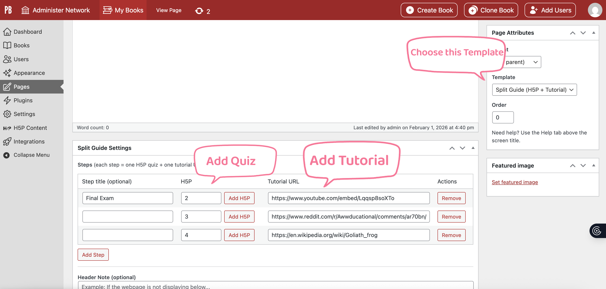
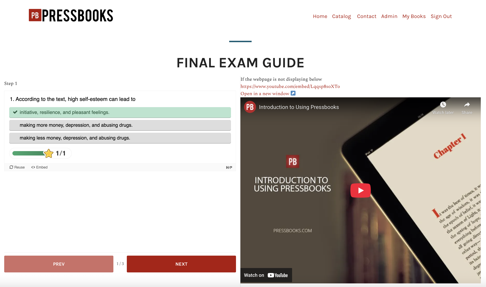

# pb-split-guide

`pb-split-guide` is a custom **Guide-on-the-Side split-screen plugin** developed for interactive tutorials where **instructional content and live resources are displayed side-by-side**, allowing learners to follow guided steps while interacting with real systems (e.g., videos, catalogues, quizzes).

This plugin is part of the **Guide-On-the-Side** project.

---

## Purpose

Traditional tutorials often force users to switch back and forth between instructions and the system they are learning.  
`pb-split-guide` addresses this problem by:

- Presenting **step-by-step instructions** in one pane
- Displaying **live embedded content** in a second pane
- Keeping navigation (Prev / Next) visible while content scrolls internally
- Students can see feedback on problems immediately.
- Integrating smoothly with Pressbooks content

---

## Key Features

- Custom **page template** for split-screen tutorials
- Two-pane responsive layout:
  - Left pane: tutorial steps / quizzes
  - Right pane: embedded live content (iframe, video, external tools)
- Internal scrolling per pane
- Progress indicator showing current position
- Scoped CSS to avoid interfering with Pressbooks global styles
- Compatible with Pressbooks **theme**
- Designed to work with **H5P quizzes**

---

## How It Works

### Page Template
- The plugin registers a custom Pressbooks page template: A special control panel is used to add quizzes and corresponding tutorials.




When a page uses this template:
- The standard Pressbooks header navigation is preserved
- The page content is rendered inside a split-screen application layout




### Installation

1. Copy the plugin pb-split-guide into:

```
web/app/plugins/

```

2. Activate it in:

```
Admin → Plugins

```
3. Create or edit a page and assign the template:

```
Page Attributes → Template → Split Guide Template

```


### Usage

- Create a Pressbooks page
- Assign the Split Guide Template
- Add tutorial content (text, H5P, links) to the page body
- Embed live resources (iframe, video, external tools) as needed