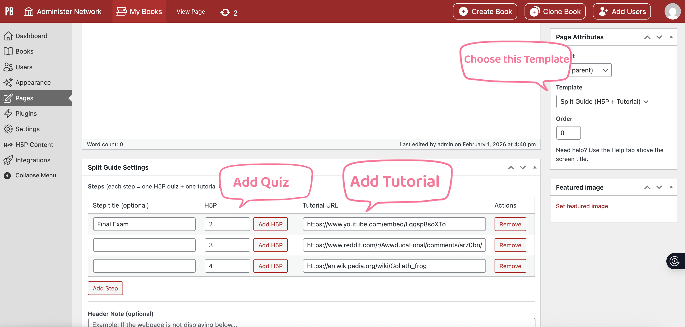
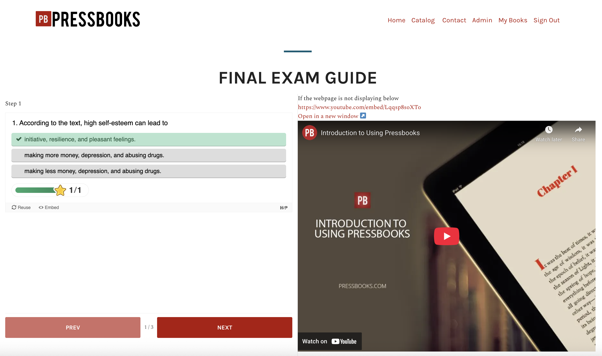

# pb-split-guide

`pb-split-guide` is a custom **Guide-on-the-Side split-screen plugin** developed for interactive tutorials where **instructional content and live resources are displayed side-by-side**, allowing learners to follow guided steps while interacting with real systems (e.g., videos, catalogues, quizzes).

This plugin is part of the **Guide-On-the-Side** project.

---

## Purpose

Traditional tutorials often force users to switch back and forth between instructions and the system they are learning.
`pb-split-guide` addresses this problem by:

- Presenting **step-by-step instructions** in one pane
- Displaying **live embedded content** in a second pane
- Keeping navigation (Prev / Next) visible while content scrolls internally
- Students can see feedback on problems immediately
- Integrating smoothly with Pressbooks content

---

## Key Features

- Custom **page template** for split-screen tutorials
- Two-pane responsive layout:
  - Left pane: tutorial steps / quizzes
  - Right pane: embedded live content (iframe, video, external tools)
- Internal scrolling per pane
- Progress indicator showing current position
- Scoped CSS to avoid interfering with Pressbooks global styles
- Compatible with Pressbooks **theme**
- Designed to work with **H5P quizzes**
- **Template picker** — start new tutorials from saved templates
- **Save as Template** — reuse any tutorial's step configuration
- **Export / Import** — share portable tutorials across servers

---

## Installation

1. Copy the plugin `pb-split-guide` into:

```
web/app/plugins/
```

2. Activate it from the **network admin** (it is network-activated):

**GUI:** `Network Admin → Plugins → pb-split-guide → Network Activate`

**CLI:**
```bash
lando wp --url=https://pressbooks.test/wp/ plugin activate h5p
lando wp --url=https://pressbooks.test/wp/ plugin activate pb-split-guide
```

3. Install certificate dependency (required for completion certificates):

```bash
lando composer require tecnickcom/tcpdf
```

> **Important:** Always use `pressbooks.test/development/wp-admin/` for tutorial editing — not `pressbooks.test/wp/wp-admin/`. The `/wp/` root site is Pressbooks's network management hub and strips non-Pressbooks admin scripts and metaboxes. The plugin UI will not load there.

---

## Authoring Tutorials

### Creating a New Tutorial

1. Go to **Tutorials → Add Tutorial** in the WordPress admin sidebar.
2. The **template picker** opens — choose a starting point:
   - **Start from scratch** — blank tutorial, no steps
   - **Split Guide (Default)** — one empty step, ready to edit
   - Any templates your team has saved via "Save as Template"
3. Enter a **title** for the tutorial.
4. Click **Create Tutorial** — the new tutorial draft opens in the editor.

> You must select a starting point and enter a title. Both fields are required.

### Adding and Editing Steps

The **Split Guide Settings** metabox appears below the page editor. Each row in the steps table is one slide of the tutorial.

Click **Add Step** to add a new step. For each step you can configure:

| Field | Description |
|-------|-------------|
| Step Title | Heading shown at the top of the left pane |
| Tutorial Type | `url` (embed a website), `h5p` (H5P quiz), or `attachment` (uploaded file) |
| Tutorial URL | URL to embed in the right pane (for `url` type) |
| H5P ID | The H5P content ID from the H5P admin (for `h5p` type) |
| Attachment | File uploaded to the media library (for `attachment` type) |
| Header Note | Optional note shown at the top of the tutorial |

#### Branch / Remediation Steps

Each step can optionally trigger a **branch review** when a student answers incorrectly:

| Field | Description |
|-------|-------------|
| Branch Mode | `none` (no branching), `review` (show remediation step) |
| Trigger After N Attempts | How many incorrect attempts before branching |
| Branch Step Title | Title for the remediation step |
| Branch Step Type | Same options as Tutorial Type above |

Steps can be reordered by dragging the handle on the left, and deleted with the trash icon.

### Saving Your Work

Click **Save Draft** or **Publish** (standard WordPress page controls at the top right) to save. The Split Guide Settings metabox auto-saves its state to the hidden `#pbsg_steps_json` field when the WordPress save fires.

---

## Template Picker (Sprint 7)

### Saving a Tutorial as a Template

From the **Split Guide Settings** metabox, click **Save as Template** (beside the Add Step button).

- A modal opens — enter a **name**, optional **description**, and optional **category**.
- The template captures the **current editor state directly** — no need to save the post first.
- The saved template appears as a card on the next "Add Tutorial" visit.

**Built-in templates** (shown with a "Built-in" badge) cannot be deleted. Templates you create can be deleted from the template picker page.

### Template Tokens

When creating a tutorial from a template, these placeholders in step data are replaced automatically:

| Token | Replaced with |
|-------|---------------|
| `{{TUTORIAL_TITLE}}` | The title you entered on the picker |
| `{{AUTHOR_NAME}}` | Your WordPress display name |
| `{{CURRENT_DATE}}` | Today's date (site date format) |
| `{{LIBRARY_CATALOG_URL}}` | Value of the `pbsg_library_catalog_url` site option |

---

## Export / Import (Sprint 7)

### Exporting a Tutorial

1. Go to **Tutorials → My Tutorials**.
2. Find the tutorial card — click **Export**.
3. A `.json` file downloads immediately.

> The tutorial must be **published** before exporting. Drafts do not appear on My Tutorials. Publish first, then export.

The export file contains:
- Tutorial title, header note, and step configuration
- All local file attachments (PDFs, etc.) embedded as base64 — the file is self-contained
- A `pbsg_version` field for format compatibility checking

> H5P quiz content is **not** included — only the H5P content ID. The receiving server must have the same H5P content ID for quizzes to work.

### Importing a Tutorial

1. Go to **Tutorials → My Tutorials**.
2. Use the **Import Tutorial** panel at the top of the page.
3. Choose the `.json` export file and click **Import**.
4. On success, a link appears: "Tutorial [name] imported successfully. Edit it now."

The importer:
- Re-uploads any embedded file attachments to the new server's media library
- Creates a new **draft** page with all steps intact
- The imported tutorial will not appear on My Tutorials until you publish it

---

## How It Works (Technical)

### Page Template

The plugin registers a custom page template (`split-guide-template.php`). Pages using this template are rendered as the split-screen application instead of the standard Pressbooks page layout.





### Data Storage

Tutorial step data is stored as post meta on the WordPress page:

| Meta Key | Type | Contents |
|----------|------|----------|
| `_wp_page_template` | string | `split-guide-template.php` — marks the page as a split guide |
| `_pbsg_steps_json` | JSON string | Array of step objects (title, type, URL, H5P ID, branch config) |
| `_pbsg_header_note` | string | Optional header note text |

### Template Storage

Saved templates are stored in the `wp_pbsg_tutorial_templates` custom table:

| Column | Type | Notes |
|--------|------|-------|
| id | BIGINT | Auto increment |
| name | VARCHAR(200) | Template display name |
| description | TEXT | Optional description shown on picker card |
| category | VARCHAR(100) | e.g. "General", "Research" |
| is_system | TINYINT | 1 = built-in (undeletable), 0 = user-created |
| steps_json | LONGTEXT | Step configuration copied from source tutorial |
| header_note | VARCHAR(500) | Header note from source tutorial |
| created_by | BIGINT | User ID of creator |
| created_at | DATETIME | Creation timestamp |

The table is created on plugin activation and on `admin_init` if missing (handles already-active installs).

---

## Local Development Setup

See `docs/DEV-SETUP-GUIDE.md` for full Lando environment setup.

For H5P-specific setup (content type cache, hub UUID workaround), see `docs/H5P-TROUBLESHOOTING.md`.

Quick reference:

```bash
# Install pressbooks-book theme dependencies (required for /development/ subsite)
lando composer install --working-dir=web/app/themes/pressbooks-book

# Activate plugins on the network
lando wp --url=https://pressbooks.test/wp/ plugin activate h5p
lando wp --url=https://pressbooks.test/wp/ plugin activate pb-split-guide
```

---

## AI Disclosure

This documentation was updated with assistance from Claude Code (Anthropic). Per course policy, all AI-assisted work is disclosed.
